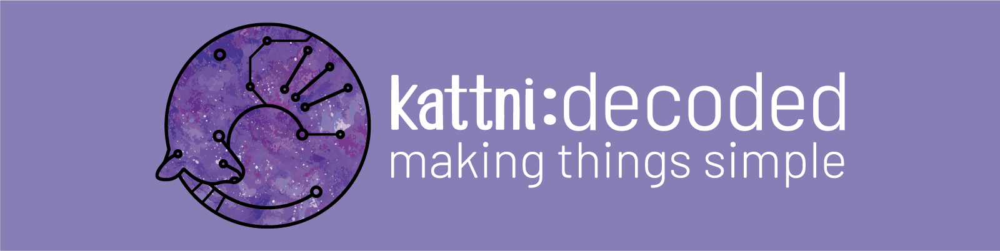

## Meet Kattni!

I am a creator, maker, photographer, programmer, intermittent chef, one-time gardener, and loved wife. I am tolerated by two cats who continue to let me live with them.

I am now pursuing my passions full time. I am passionate about learning new things, creating thorough documentation, and sharing what I know and learn. You can find project builds, tech tutorials, and approachable information here on GitHub, on [my blog](https://kattni.com), and on [my Patreon](https://patreon.com/kattni).

I spent the last five years as an open source community leader, mentor, technical writer, embedded software developer, library manager, and intermittent embedded hardware designer sponsored by Adafruit to work with the CircuitPython project. 

### Sponsor Kattni on GitHub

I am sponsored on GitHub by amazing folks who enable me to further share my knowledge. [Find out more](https://github.com/sponsors/kattni) about why you should sponsor me.

<!--

-->
